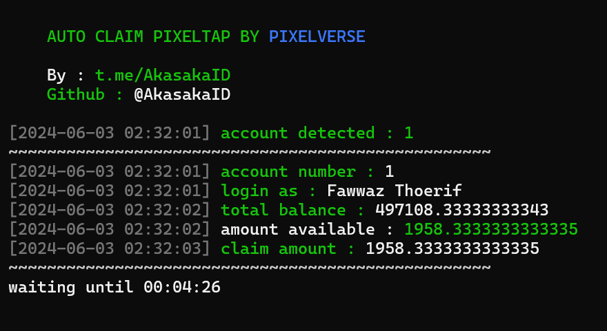

# pixelversexyzbot

Auto claim for pixeltap by pixelverse

<center>

</center>

# Table of Contents
- [pixelversexyzbot](#pixelversexyzbot)
- [Table of Contents](#table-of-contents)
- [Feature](#feature)
- [Registration](#registration)
- [How to Use](#how-to-use)
  - [Setup Daily Combo](#setup-daily-combo)
  - [Config.json Explanation](#configjson-explanation)
  - [Windows](#windows)
  - [Linux](#linux)
  - [Termux](#termux)
- [How to Get Data](#how-to-get-data)
- [Video Guide \& Android Guide](#video-guide--android-guide)
- [Javascript Command to Get Telegram Data for Desktop](#javascript-command-to-get-telegram-data-for-desktop)
- [Support](#support)
- [Discussion](#discussion)
- [Thank you \< 3](#thank-you--3)

# Feature

- [x] Auto Claim Point
- [x] Auto Claim Daily Reward
- [x] Suppport Multi Account
- [x] Apply Daily Combo with User Input
- [x] Auto Upgrade Pet
- [x] Input data manually (no login require)

# Registration

Start bot : [HERE](https://t.me/pixelversexyzbot?start=629438076)

# How to Use

## Setup Daily Combo

Here's how to use the daily combo function.
for example daily combo today is like image below


Okay, then look at the image below. The image below is the sequence of images to fill in the `combo.txt` file


So, fill the `combo.txt` with the number and separate with comma (,) for example today is number for the combo is:

```
1,11,14,15
```

## Config.json Explanation

| Key                   | Value             | Description                                                                                                                      |
| --------------------- | ----------------- | -------------------------------------------------------------------------------------------------------------------------------- |
| countdown             | integer (second)  | sleep time before next claim                                                                                                     |
| interval              | integer (second)  | sleep time every account                                                                                                         |
| auto_buy_pet          | bool (true/false) | auto buy pet function if buy pet is available                                                                                    |
| max_pet               | integer           | max number of pets owned if the number of pets is more than or equal to max_pet then the auto_buy_pet function will be disabled. |
| auto_upgrade_pet      | bool (true/false) | auto upgrade pet function                                                                                                        |
| max_level_upgrade_pet | integer           | max level of pet if level of pet is over than in config.json auto_upgrade_pet function will disable / off                        |

## Windows 

1. Make sure you computer was installed python and git.
   
   python site : [https://python.org](https://python.org)
   
   git site : [https://git-scm.com/](https://git-scm.com/)

2. Clone this repository
   ```shell
   git clone https://github.com/akasakaid/pixelversexyzbot.git
   ```

3. goto pixelversexyzbot directory
   ```
   cd pixelversexyzbot
   ```

4. install the require library
   ```
   python -m pip install -r requirements.txt
   ```

5. fill the `data.txt` file with your data, how to get data you can refer to [How to Get Data](#how-to-get-data)
6. execute the main program 
   ```
   python bot.py
   ```

## Linux

1. Make sure you computer was installed python and git.
   
   python
   ```shell
   sudo apt install python3 python3-pip
   ```
   git
   ```shell
   sudo apt install git
   ```

2. Clone this repository
   
   ```shell
   git clone https://github.com/akasakaid/pixelversexyzbot.git
   ```

3. goto pixelversexyzbot directory

   ```shell
   cd pixelversexyzbot
   ```

4. Install the require library
   
   ```
   python3 -m pip install -r requirements.txt
   ```

5. fill the `data.txt` file with your data, how to get data you can refer to [How to Get Data](#how-to-get-data)
6. execute the main program 
   ```
   python bot.py
   ```

## Termux

1. Make sure you termux was installed python and git.
   
   python
   ```
   pkg install python
   ```

   git
   ```
   pkg install git
   ```

2. Clone this repository
   ```shell
   git clone https://github.com/akasakaid/pixelversexyzbot.git
   ```

3. goto pixelversexyzbot directory
   ```
   cd pixelversexyzbot
   ```

4. install the require library
   ```
   python -m pip install -r requirements.txt
   ```

5. fill the `data.txt` file with your data, how to get data you can refer to [How to Get Data](#how-to-get-data)
6. execute the main program 
   ```
   python bot.py
   ```

# How to Get Data
   
   1. Active web inspecting in telegram app, How to activate follow the video [https://youtu.be/NYxHmck_GjE](https://youtu.be/NYxHmck_GjE)
   2. Goto gamee bot and open the apps
   3. Press `F12` on your keyboard to open devtool or right click on app and select `Inspect`
   4. Goto `console` menu and copy [javascript code](#javascript-command-to-get-telegram-data-for-desktop) then paste on `console` menu
   5. If you don't receive error message, it means you successfully copy telegram data then paste on `data.txt` (1 line for 1 telegram data)
   
   Example telegram data

   ```
   query_id=xxxxxxxxxx&user=xxxxxxfirst_namexxxxxlast_namexxxxxxxusernamexxxxxxxlanguage_codexxxxxxxallows_write_to_pmxxxxxxx&auth_date=xxxxxx&hash=xxxxxxxxxxxxxxxxxxxxx
   ```

   6. If you want to add more account. Just paste telegram second account data in line number 2.
   
   Maybe like this sample in below

   ```
   1.query_id=xxxxxxxxxx&user=xxxxxxfirst_namexxxxxlast_namexxxxxxxusernamexxxxxxxlanguage_codexxxxxxxallows_write_to_pmxxxxxxx&auth_date=xxxxxx&hash=xxxxxxxxxxxxxxxxxxxxx
   2.query_id=xxxxxxxxxx&user=xxxxxxfirst_namexxxxxlast_namexxxxxxxusernamexxxxxxxlanguage_codexxxxxxxallows_write_to_pmxxxxxxx&auth_date=xxxxxx&hash=xxxxxxxxxxxxxxxxxxxxx
   ```

# Video Guide & Android Guide

Watch the video via following link for guidance : [https://youtu.be/KTZW9A75guI](https://youtu.be/KTZW9A75guI)

# Javascript Command to Get Telegram Data for Desktop

```javascript
copy(Telegram.WebApp.initData)
```

# Support

To support me you can buy me a coffee via website in below

- Send IDR directly via QRIS : [https://s.id/nusanqr](https://s.id/nusanqr)
- https://trakteer.id/fawwazthoerif/tip
- https://sociabuzz.com/fawwazthoerif/tribe

# Discussion

If you have any question or something you can ask in here : [@sdsproject_chat](https://t.me/sdsproject_chat)

# Thank you < 3