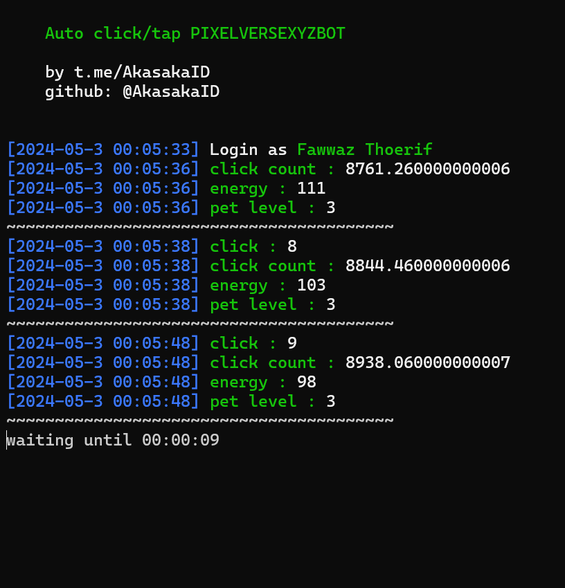

# pixelversexyzbot

Auto tap/click for pixelversexyzbot

<center>

</center>

# Disclaimer
*❗ I am not responsible if anything happens to your account.*

# Install

1. Register the following url https://t.me/pixelversexyzbot?start=629438076

2. Make sure your machine has git and python installed
   
   if not installed, then install it using the following command.
   
   ### Python

   For Windows you can direcly download python from https://python.org

   For Linux Ubuntu

   ```
   sudo apt install python3 python3-pip
   ```

   For Android Termux

   ```
   pkg install python
   ```

    ### Git

    For windows you can direcly download from https://git-scm.com/download/win

    For Linux Ubuntu

    ```
    sudo apt-get install git-all
    ```

    For Android Termux

    ```
    pkg install git
    ```

3. Clone this repository
   
   ```
   git clone https://github.com/akasakaid/pixelversexyzbot.git
   ```

4. Goto folder pixelversexyzbot
   
   ```
   cd pixelversexyzbot
   ```

5. This is optional step but i recommend it, create virtual environment
   
   For Windows

   ```
   python -m venv env
   ```

   For Linux

   ```
   python3 -m venv env
   ```

   For Android Termux
   
   if you can't run command below just, skip it !

   ```
   python -m venv env
   ```

   Active the environment variable

   For Windows
    ```
   env\scripts\activate.bat
    ```

    For Linux and Android Termux
    ```
    source env/bin/activate
    ```


6. Install library / module

```
pip install -r requirements.txt
```

7. Copy `.env.example` to `.env`
8. You can edit the `.env` file, I've made notes about the variables in the file

9. Run the program

```
python bot.py phone_number
```

# Support

To support me you can buy me a coffee via website in below

- https://trakteer.id/fawwazthoerif/tip
- https://sociabuzz.com/fawwazthoerif/tribe

# Thank you < 3